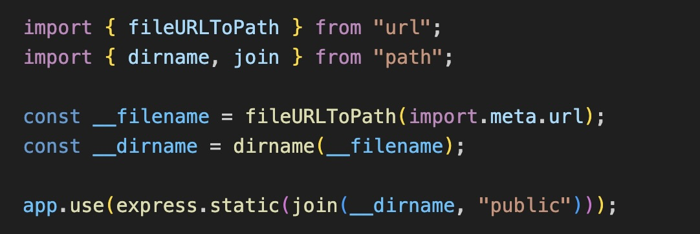
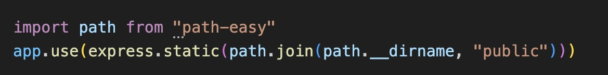

# path-easy

Simplified `path` module for ESM with `__dirname` and `__filename` support. 
Allows you to use familiar `CommonJS` syntax directly in ESM projects.

how it was before path-easy:



how it look like after path-easy:



## installation

```bash
npm install path-easy